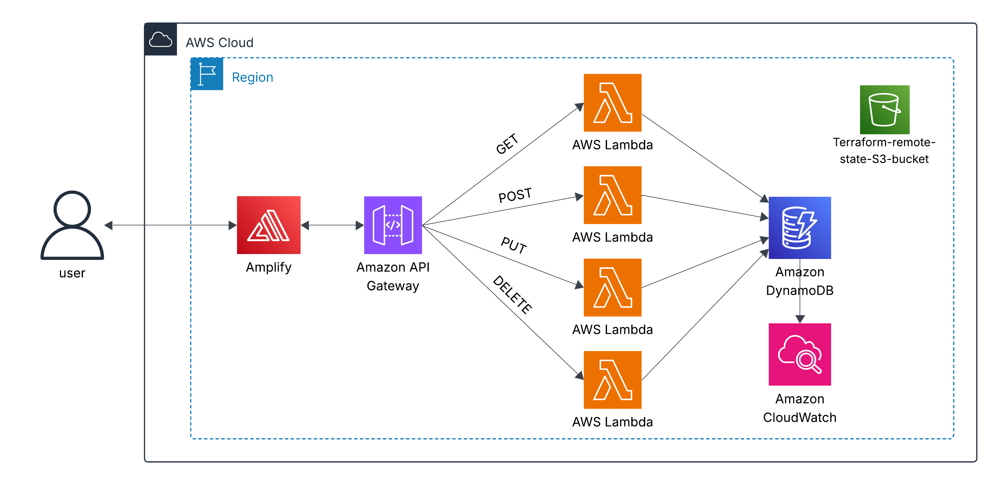

# ☕ Serverless Coffee Inventory Management on AWS (Cost Optimization & Serverless Architecture)

## 📌 Project Overview

This Terraform-based project demonstrates a fully serverless, event-driven inventory management system built entirely on AWS. It showcases modern cloud architecture patterns with automated infrastructure deployment, serverless compute, and continuous deployment through AWS Amplify. The application features a React frontend with modern gradient UI, RESTful API backend powered by Lambda functions, and DynamoDB for data persistence—all orchestrated through Infrastructure as Code.

---

## 🖼️ Architecture Diagram


---

## ✅ Prerequisites

- AWS CLI authenticated to your account
- Terraform >= 1.5.0
- Node.js >= 18.x and npm
- GitHub account with repository access
- GitHub Personal Access Token (for Amplify auto-deployment)
- Basic knowledge of React, REST APIs, and serverless architecture

---

## 🎯 Key Objectives

- ☕ Build a full-stack serverless coffee inventory CRUD application
- 🚀 Deploy React frontend automatically via AWS Amplify
- 🔄 Implement RESTful API with API Gateway and Lambda (Node.js 20.x)
- 💾 Use DynamoDB as serverless NoSQL database
- 📊 Monitor operations with CloudWatch logs
- 🔐 Apply least-privilege IAM roles for Lambda execution
- 🏗️ Provision entire infrastructure using Terraform modules

---

## 📁 Folder Structure

```
Serverless-Inventory-Management-on-AWS/
├── Diagram/
│   └── Serverless-Inventory-Management-on-AWS.png
├── frontend/
│   ├── public/
│   ├── src/
│   │   ├── api.js
│   │   ├── App.js
│   │   ├── CoffeeForm.js
│   │   ├── CoffeeList.js
│   │   ├── index.js
│   │   └── styles.css
│   ├── package.json
│   └── package-lock.json
├── lambda/
│   ├── get_coffee/
│   │   ├── index.js
│   │   └── package.json
│   ├── post_coffee/
│   │   ├── index.js
│   │   └── package.json
│   ├── put_coffee/
│   │   ├── index.js
│   │   └── package.json
│   └── delete_coffee/
│       ├── index.js
│       └── package.json
├── modules/
│   ├── amplify/
│   ├── api_gateway/
│   ├── cloudwatch/
│   ├── dynamodb/
│   ├── iam/
│   └── lambda/
├── state-bucket/
│   └── main.tf
├── main.tf
├── variables.tf
├── terraform.tfvars
├── outputs.tf
└── README.md
```

---

## 🔁 Application Flow

### User Journey

1. **User opens the web app** → AWS Amplify serves React frontend
2. **User views inventory** → React calls API Gateway → Lambda executes GET → DynamoDB scans table
3. **User adds coffee** → Form submission → POST request → Lambda inserts item → DynamoDB stores data
4. **User updates price** → Edit button → PUT request → Lambda updates item → DynamoDB modifies record
5. **User deletes coffee** → Delete button → DELETE request → Lambda removes item → DynamoDB deletes record
6. **All actions logged** → CloudWatch captures Lambda execution logs

### Infrastructure Flow

```
GitHub Repo → AWS Amplify (CI/CD) → React App Deployment
                                   ↓
User Request → CloudFront → API Gateway → Lambda Functions → DynamoDB
                                              ↓
                                        CloudWatch Logs
```

---

## 🚀 Deployment Sequence

### ⚠️ Step 1: Clone Repository

```bash
git clone https://github.com/your-username/Serverless-Inventory-Management-on-AWS.git
cd Serverless-Inventory-Management-on-AWS
```

### ⚙️ Step 2: Configure Remote State Backend

```bash
terraform -chdir=state-bucket init
terraform -chdir=state-bucket plan
terraform -chdir=state-bucket apply -auto-approve
```

### ⚙️ Step 3: Prepare Lambda Functions

```bash
# Package Lambda functions
cd lambda/get_coffee && zip -r ../get_coffee.zip . && cd ../..
cd lambda/post_coffee && zip -r ../post_coffee.zip . && cd ../..
cd lambda/put_coffee && zip -r ../put_coffee.zip . && cd ../..
cd lambda/delete_coffee && zip -r ../delete_coffee.zip . && cd ../..
```

### ⚙️ Step 5: Deploy Infrastructure

```bash
terraform init
terraform plan -var-file="terraform.tfvars"
terraform apply -var-file="terraform.tfvars"
```

### ⚙️ Step 6: Update Frontend API Endpoint

AWS Amplify will automatically rebuild and deploy.

After deployment, update the API endpoint in `frontend/src/api.js` for local testing:

```javascript
const BASE_URL = "https://your-api-id.execute-api.us-east-1.amazonaws.com/dev";
```

Then commit and push:

```bash
git add frontend/src/api.js
git commit -m "Update API endpoint"
git push origin main
```

### ⚙️ Step 8: Teardown

```bash
terraform destroy -var-file="terraform.tfvars"
terraform -chdir=state-bucket destroy -auto-approve
```
---

## 🧩 Common Errors & Fixes

❌ **Error: `npm ci` can only install packages when your package.json and package-lock.json are in sync**
**Cause:** package-lock.json out of sync after dependency updates
**Fix:**
```bash
cd frontend
rm -rf node_modules package-lock.json
npm install
git add package-lock.json
git commit -m "Fix package-lock sync"
git push
```

❌ **Error: API Gateway CORS errors in browser console**
**Cause:** Missing CORS headers in Lambda responses
**Fix:** Verify all Lambda functions return proper CORS headers:
```javascript
headers: {
  "Access-Control-Allow-Origin": "*",
  "Access-Control-Allow-Headers": "*",
  "Access-Control-Allow-Methods": "OPTIONS,POST,GET,PUT,DELETE"
}
```

❌ **Delete operation not working in frontend**
**Cause:** API Gateway or Lambda permission misconfiguration
**Fix:**
- Check API Gateway has DELETE method configured
- Verify Lambda has correct DynamoDB permissions (`dynamodb:DeleteItem`)
- Check CloudWatch logs for detailed error messages

---

## 🧠 Notes

- **Lambda Runtime:** Using Node.js 20.x (latest stable AWS Lambda runtime)
- **AWS SDK:** All Lambda functions use AWS SDK v3 for better performance
- **React Version:** 18.3.1 with modern `createRoot` API
- **Frontend Build:** Amplify uses `npm ci` for reproducible builds
- **CORS:** Fully configured for cross-origin requests
- Always destroy main infrastructure before tearing down remote state bucket

---

## 🔧 What Could Be Improved

- Extend functionality to support S3 image uploads for coffee products
- Integrate CI/CD pipeline with automated testing
- Add AWS Cognito for user authentication and authorization
- Implement WAF rules for DDoS protection

